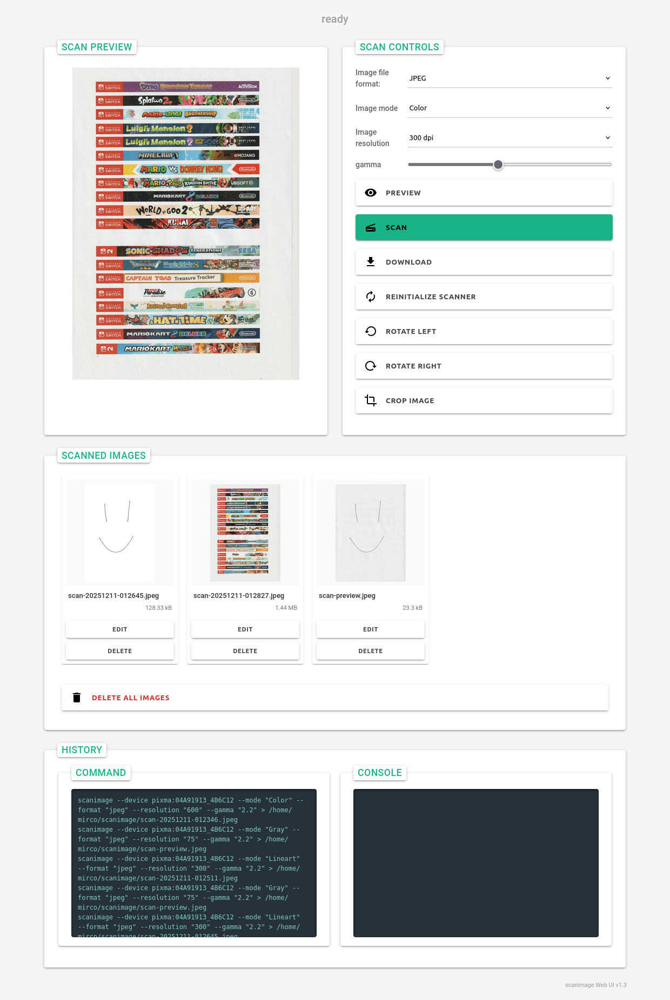

# scanimage Web UI

A web-based interface for the Linux SANE `scanimage` command.
The application uses Python and JavaScript and runs on `localhost:7800` or any other configured port.
It allows you to share a USB scanner over the network so multiple users can access it.
You can also run it on a Raspberry Pi, for example using Raspberry Pi OS.

## Installation

```bash
sudo apt update && sudo apt install sane-utils -y
wget https://gitlab.com/alda78/scanimage-webui/-/archive/master/scanimage-webui-master.tar
tar -xf scanimage-webui-master.tar
cd scanimage-webui-master/
sudo python3 setup.py install
cd ..
sudo rm -rf scanimage-webui-master
```

or simply

```bash
apt update && apt install sane-utils -y
pipx install scanimage-webui-reborn  # not available via pip yet, soon
```

## Running

```bash
scanimage-webui --help
usage: scanimage-webui [-h] [-p PORT] [-d SCAN_DIRECTORY]

scanimage Web UI v1.2.3

optional arguments:
  -h, --help            show this help message and exit
  -p PORT, --port PORT  APP server port
  -d SCAN_DIRECTORY, --scan-directory SCAN_DIRECTORY
                        Directory where scanned images will be stored.
```

## `systemd` configuration

```bash
echo '[Unit]
Description=ScanImageWebUI

[Service]
ExecStart=/bin/sh "/usr/local/bin/scanimage-webui >> /var/log/scanimage-webui.log 2>&1 &"
ExecStop=killall scanimage-webui
ExecRestart=/bin/sh "killall scanimage-webui && /usr/local/bin/scanimage-webui >> /var/log/scanimage-webui.log 2>&1 &"
ExecStatus=ps -ax | grep scanimage-webui
Type=forking

[Install]
WantedBy=multi-user.target
' > /lib/systemd/system/scanimage-webui.service
systemctl enable scanimage-webui.service
```

after that you can use

```bash
systemctl start scanimage-webui.service
```

## Screenshot




## TODOs

* Rename "gamma" label to "Gamma"
* Add button to download PDF
* Pack and upload to PyPI
